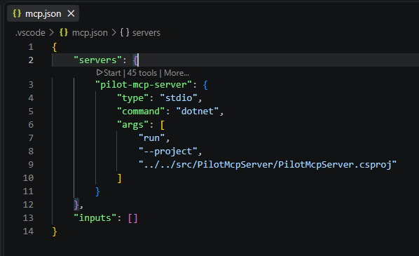
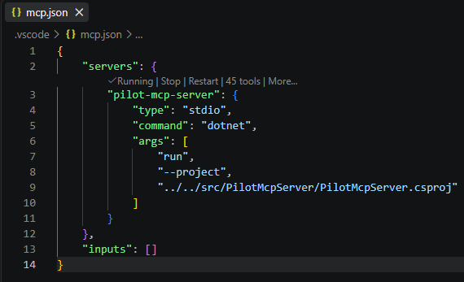

# Testing the Pilot MCP Server

# Start

Open the .vscode/mcp.json file.  It will appear similar to the following:



Note the `Start` ghost text right above the 'pilot-mcp-server' section.

Click on the Start text, and observe that the ghost text changes to 'Running'.

If anything different is displayed, troubleshoot and correct.

When running corrrectly, it will appear similar to the following:



# Testing

Focus on the Chat window and run the tests.

In the chat window, a tool can be selected in two different ways:
- Manual clicks:
    - Click on the Add Context button (plus sign). 
    - Select 'Tools' in the menu that appears. 
    - Select the tool item - it will now appear in the chat window, after a plus sign.
- Typing:
    - type the '@' sign followed by the name of the desired tool.  For example:
    ```
    @get_healthcheck
    ```

## Tests

### 1. Healthcheck
- Specify the 'get_healthcheck' tool.
- Type 'Execute'.
- Expected result:

```
Health check passed: true
```

### 2. About
- Specify the 'get_about' tool.
- Type 'Display'.
- Expected result:

```
Name: PilotApiDotNet
API version: 1.0.0
Build: 1.0.0+7f9e2cec1060a74d8e2005d6cf563ba83ec77d6c
Deployed: 2026-08-27 15:57:07Z
```

### 3. List APIs
- Specify the 'list_apis' tool.
- Type 'List'.
- Expected result:

| API | Address | Available | Build | Selected |
| --- | --- | --- | --- | --- |
| .NET Core with SQL Server | localhost:55101 | Yes | 1.0. +7f9e2cec1060a74d8e2005d6cf563ba83ec77d6c | Yes |
| .NET Core with PostgreSQL | localhost:55201 | Yes | 1.0.0+7f9e2cec1060a74d8e2005d6cf563ba83ec77d6c | No |
| Java Spring Boot with SQL Server | localhost:55301 | Yes | 0.2.0 | No |
| Java Spring Boot with PostgreSQL | localhost:55401 | Yes | 0.2.0 | No |
| Python with SQL Server | localhost:55501 | Yes | 1.0.0 | No |
| Python with PostgreSQL | localhost:55601 | Yes | 1.0.0 | No |

### 4. List Endpoints
- Specify the 'list_endpoints' tool.
- Type 'List'.
- Expected result:

| Resource | Operations | Routes |
| --- | --- | --- |
| Categories | GetAll, Get, Add, Update, Delete | /categories/... |
| Customers | GetAll, Get, Add, Update, Delete | /customers/... |
| Employees | GetAll, Get, Add, Update, Delete | /employees/... |
| OrderDetails | GetAll, Get, Add, Update, Delete | /order-details/... |
| Orders | GetAll, Get, Add, Update, Delete | /orders/... |
| Products | GetAll, Get, Add, Update, Delete | /products/... |
| Shippers | GetAll, Get, Add, Update, Delete | /shippers/... |
| Suppliers | GetAll, Get, Add, Update, Delete | /suppliers/... |
| System | HealthCheck, About | /healthcheck, /about |

### 5. Select API
- Specify the 'select_api' tool.
- Type 'Select "Java Spring Boot with PostgreSQL"'.
- Expected result:

```
Selected and verified: Java Spring Boot with PostgreSQL at localhost:55401 is now the active API deployment.
```

Executing the 'list_apis' tool will now show the 'Java Spring Boot with PostgreSQL' API as selected.

### 6. Get Category
- Specify the 'get_category' tool.
- Type 'Get where ID = 1'.
- Expected result:

| ID | Category | Description | Picture |
| --- | --- | --- | --- |
| 1 | Beverages | Soft drinks, coffees, teas, beers, and ales | Present |

# Cleanup

Return to the mcp.json file.

Click on the 'Stop' ghost text, to stop the MCP Server.
